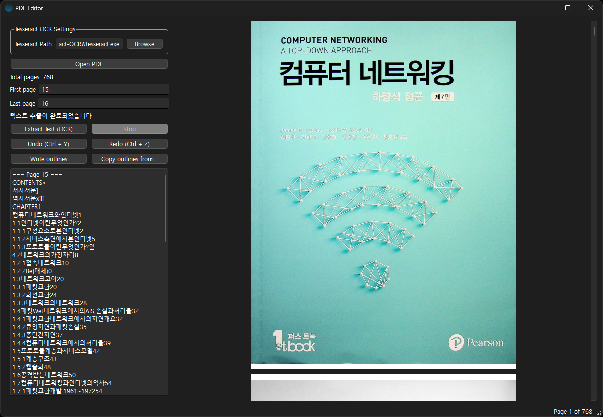

# PDF Editor



## Dependencies

- Google Tesseract OCR
- PyQt
- PyMuPDF

## Prerequisites

- [Tesseract OCR](https://github.com/tesseract-ocr/tesseract)
  - Windows 11의 기본 설치 경로는 `C:\Program Files\Tesseract-OCR`
- [tessdata](https://github.com/tesseract-ocr/tessdata)는 다운로드 후 설치 경로의 `tessdata` 폴더에 복사
  - [kor](https://github.com/tesseract-ocr/tessdata/blob/main/kor.traineddata)
  - (Optional) [세로 kor](https://github.com/tesseract-ocr/tessdata/blob/main/kor_vert.traineddata): 필요한 경우 설치하고 `kor` 대신 `kor_vert` 언어 코드를 사용

## Build on Windows 11

```shell
# Virtual Environment 생성
python -m venv venv

# Windows 11
venv\Scripts\activate
# Unix-like
source venv/bin/activate

# 패키지 설치
pip install -r requirements.txt
```

```shell
make build
```

- `--onefile` 실행 파일을 하나의 단일 파일로 패키징.
- `--windowed` 콘솔 창 없이 GUI 모드로 실행.
- `--clean` 옵션은 빌드를 시작하기 전에 PyInstaller가 이전 빌드에서 생성한 임시 파일들을 삭제한다.

혹은 `.spec` 파일을 작성해서 빌드한다.

```shell
pyinstaller --clean app.spec
```
